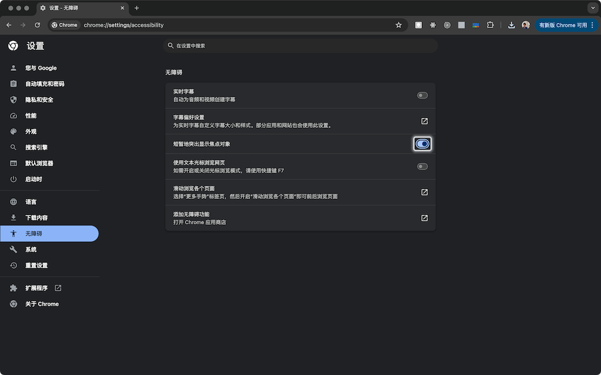

# navbar-153

<a href="https://996.icu"></a>

English | [中文](./README.md)

navbar-153 is a React navigation menu component that includes a set of triggers and a corresponding set of menu panels. Users can expand, switch, and collapse the menu panels through the triggers. The navigation menu typically appears at the top of a website, providing the most desired links and other controls for users.

Features include:

- 🍯 Smooth transition animation
- ⌨️ Keyboard navigation.
- ♿️ Assistive devices navigation.
- 🎨 Highly customizable.

You can open [the demo link](https://wswmsword.github.io/examples/navbar-153/en) to see how it works.

<details>
<summary>In Chrome, you can enable the 'Show a quick highlight on the focused object' accessibility feature to visually track the focus movement of components.</summary>

You can enter `chrome://settings/accessibility` in the address bar or go to 'Settings -> Accessibility' to enable 'Show a quick highlight on the focused object'.



</details>

## Installation and Usage

With npm：

```bash
npm install navbar-153
```

Below is the general layout of using components after installation. For a complete example, you can open [the `dark-space` folder in the repository](./examples/dark-space) (Next.js project) to view.

```javascript
import N from "navbar-153";
const { Trigger, Item, Content } = N;
function MyNavBar() {
  const contentItemStyle = props => ({ ...props.style, width: "100%", flexShrink: 0 });
  return (
    <N style={{ position: "relative" }}>
      <Trigger style={{ display: "flex", gap: 8 }}>
        <Item><a href="https://github.com/wswmsword/navbar-153">Repo</a></Item>
        <Item>{props => <button {...props}>Trigger 1</button>}</Item>
        <Item>{props => <button {...props}>Trigger 2</button>}</Item>
        <Item>{props => <button {...props}>Trigger 3</button>}</Item>
      </Trigger>
      <Content className="panelsWrapper">
        <Item>{props => <div {...props} style={contentItemStyle(props)}>Content 1</div>}</Item>
        <Item>
          {(props, head, tail) => <div {...props} style={contentItemStyle(props)}>
            <a href="https://react.dev/?uwu" ref={head}>React</a>
            vs
            <a href="https://vuejs.org/?uwu" ref={tail}>Vue</a>
          </div>}
        </Item>
        <Item>{props => <div {...props} style={contentItemStyle(props)}>Content 3</div>}</Item>
      </Content>
    </N>
  );
}
export default MyNavBar;
```

## API

The navigation menu component is composed of several components: `<N>`、`<Trigger>`、`<Content>` and `<Item>`.

### N (Root)

The outermost component of the navigation menu component is imported by default when used, for example:

```javascript
import N from "navbar-153";
```

`<N>` will be rendered as `<nav>` as the outermost layer of the navigation menu component. `<N>` accepts props for HTML elements and the following additional options:

- `motion`, boolean, whether to reduce motion
- `dur`, number, define the duration of the transition animation (s)
- `gap`, number, Set the distance between the panel and the trigger (px)
- `dynamicWidth`, boolean, allow the panel width to vary
- `onlyKeyFocus`, boolean, set focus transfer to occur only when controlled by the keyboard
- `close`, boolean, follow the trigger's position when toggling panels

### Trigger

Import the `<Trigger>` component like this:

```javascript
import N from "navbar-153";
const { Trigger, Content, Item } = N;
```

`<Trigger>` is rendered as a `<div>` within `<nav>` as a child element. `<Trigger>` accepts any built-in props. Inside `<Trigger>` component is a set of triggers, so you can pass className or style to define the layout of the trigger.

### Content

`<Content>` is imported in the same way as `<Trigger>`. Inside `<Content>`, there is a set of content panels, each corresponding sequentially to the triggers inside `<Trigger>`. `<Content>` and `<Trigger>` should be at the same hierarchy level. `<Content>` is rendered as a two-layer `<div>`, accepting any built-in props, with these props ultimately affecting the outer `<div>`. Additionally, you can pass `inner`, where the objects in `inner` will be passed as props to the inner `<div>`. You can also pass `className` or `style` to `<Content>` to set styles like shadows for the panels.

### Item

`<Item>` is imported in the same way as `<Trigger>`. `<Item>` must be a direct child element of `<Trigger>` or `<Content>`. In `<Trigger>`, `<Item>` serves as a trigger, while in `<Content>`, `<Item>` serves as a content panel. `<Item>` does not accept any parameters.

When `<Item>` is used within `<Trigger>`, its children can either be a trigger or a regular element, with each trigger corresponding to a content panel. If the children are a component or a specific element like `<a>`, `<Item>` is treated as a regular element. If the children are render props, `<Item>` is treated as a trigger, as shown below:

```javascript
<Item>{props => <button {...props}>Trigger 1</button>}</Item>
```

The props in the example above must be passed to the trigger element, which includes necessary information such as events, ARIA labels, and others.

When `<Item>` is used within `<Content>`, its children is a content panel, and the children must be render props, as shown below:

```javascript
<Item>
  {(props, head, tail) => <div {...props} style={{ ...props.style, width: "100%", flexShrink: 0 }}>
    <a href="https://react.dev/?uwu" ref={head}>React</a>
    vs
    <a href="https://vuejs.org/?uwu" ref={tail}>Vue</a>
  </div>}
</Item>
```

The props in the example above must be passed to the content panel element, which also includes necessary information such as events, ARIA labels, etc. The render props' input parameters also provide a second parameter `head` and a third parameter `tail`. If the content panel contains focusable elements, `head` must be passed as a `ref` to the first focusable element, and `tail` as a `ref` to the last focusable element. These two `refs` facilitate keyboard <kbd>Tab</kbd> navigation. If the content panel only displays content without focusable elements, these two parameters can be ignored.

## Keyboard Interactions

| Key | Description |
|:--|:--|
| <kbd>Tab</kbd> | When the focus is on the trigger, it will move forward one by one. When the focus is on the content panel, the focus will cycle between the head element and the tail element. |
| <kbd>Space</kbd> <kbd>Enter</kbd> | When the focus is on the trigger, pressing a key will expand or collapse the content panel. |
| <kbd>Esc</kbd> | When the focus is in the content panel, pressing a key will collapse the panel, and the focus returns to the trigger. |

## Instructions

In macOS, users might not be able to use the <kbd>Tab</kbd> key to focus on link elements in Firefox. Users need to follow these steps: open 'System Settings', open 'Keyboard', and then open '[Keyboard navigation](https://support.apple.com/guide/mac-help/use-your-keyboard-like-a-mouse-mchlp1399)'.

## Development and Maintenance Direction

Run the following command in the project root directory to monitor changes in the component source code and update the output in real-time:

```bash
npm run watch
```

Keep the above monitoring command running, then open a new terminal session and run the following command to start the React demo application that includes the source components. This allows you to see the effects in the browser in real-time as you modify the source code:

```bash
cd examples/demo
npm i
npm run dev
```

Here, I will show you the goals of this project, focusing on end-users, developers, and source code maintenance. Ultimately, we hope you can also contribute to improving this project:

- Accessibility
  - Proper ARIA labels, validated by Android TalkBack and iOS/MacOS VoiceOver
  - Fully controllable via keyboard
  - Toggleable opening and closing transition animations
- Smooth transition animations
- Good performance
- Excellent developer experience
  - Intuitive usage patterns
  - Retains core functionality of the navigation menu without infringing on developer customization
- Simple documentation
- Code organization
  - No need to follow specific formatting conventions, feel free to use your preferred style
  - Appropriate naming in the code, with detailed comments to aid understanding when suitable names are not found
  - Promote and demote functions to find the appropriate level of abstraction

Understand [some principles (CN)](./how-it-works.md).

## CHANGELOG

Check the [changelog](./CHANGELOG.md).

## Versioning

Check the [SemVer 2.0.0](https://semver.org/).

## License

Check the [MIT License](./LICENSE)。

## Support and Sponsorship

Feel free to issue, PR, and star the project. You can also contribute financially, with the amount based on the benefits you gain from the project.

<details>
<summary>Expand to view QR codes for WeChat Pay and Alipay.</summary>

<table>
  <tr align="center">
    <td>WeChat Pay</td>
    <td>Alipay</td>
  </tr>
	<tr>
		<td></td>
		<td></td>
	</tr>
</table>

</details>
